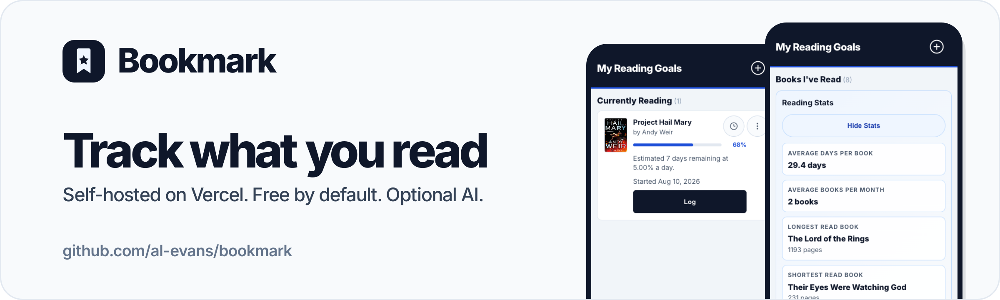
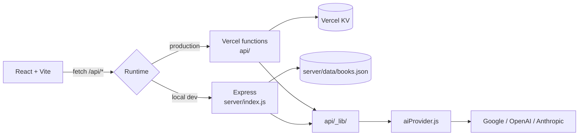

<div align="center">

<a href="https://al-evans.github.io/bookmark/">
  
</a>

Bookmark is a self-hosted reading tracker built with React + Vite for Vercel.
Log books, track progress, see finished stats, and optionally bring your own
AI key for book search and reading tips.

**Own your data.** No hosted service, no shared AI key, no required paid plan.

[](https://github.com/al-evans/bookmark/actions/workflows/ci.yml)
[](LICENSE)
[](CONTRIBUTING.md)

[**▶ Watch the demo**](https://al-evans.github.io/bookmark/) ·
[**Deploy your own**](#deploy-your-own) ·
[**Bring your own AI**](#bring-your-own-ai)

</div>

---

## Features

| Feature | What it does |
|---|---|
| **Books I've Read** | Everything you've finished, grouped by month and year |
| **Want to Read** | A queue of what's next |
| **Add books** | Manually, via Open Library search, or via AI search fallback |
| **Progress tracking** | Log absolute progress (`0`–`100`) and keep the full history |
| **Reading speed estimate** | Days remaining based on your logged pace |
| **Daily push reminder** | Vercel Cron notifies your phone when you haven't logged today |
| **Weekly private backup** | Optional GitHub Action snapshots your KV data to JSON |
| **Bring your own AI** | Google Gemini, OpenAI, or Anthropic — or none at all |

## Deploy your own

You do not need a terminal. The default path stays free: Vercel Hobby for
hosting, a free Upstash Redis store for your books, and no AI key unless you
want one.

[](https://vercel.com/new/clone?repository-url=https%3A%2F%2Fgithub.com%2Fal-evans%2Fbookmark&project-name=bookmark&repository-name=bookmark&env=APP_PASSWORD&envDescription=Pick%20a%20password%20that%20unlocks%20your%20reading%20list.%20Bookmark%20asks%20for%20it%20once%2C%20then%20keeps%20it%20only%20in%20your%20browser.%20Any%20long%20phrase%20works.&envLink=https%3A%2F%2Fal-evans.github.io%2Fbookmark%2F%23password&stores=%5B%7B%22type%22%3A%22integration%22%2C%22integrationSlug%22%3A%22upstash%22%2C%22productSlug%22%3A%22redis%22%2C%22protocol%22%3A%22storage%22%7D%5D)

### 1. Click the button

Vercel copies this repository into your own GitHub account. Sign in with
GitHub if you are not signed in already.

### 2. Fill in the one screen Vercel shows you

| Field | What to do |
|---|---|
| **Storage** | Vercel offers an Upstash Redis store. Accept it and pick the free plan. This is where your books live. |
| **`APP_PASSWORD`** | Type a password. It keeps strangers out of your reading list. Need one? [Generate a password](https://al-evans.github.io/bookmark/#password) — it is made in your browser and never sent anywhere. |

Because the storage and the password are both set before the first build,
you do not have to deploy a second time.

### 3. Open your app and enter that password

When the deploy finishes, Vercel shows your new address. It looks like
`bookmark-a1b2c3.vercel.app`. You can find it again on the project page in
Vercel under **Domains**.

Open that address in any browser. Bookmark asks for the password once and
keeps it only in that browser. To read your list on your phone as well, open
the same address there and enter the same password.

> **The address is public.** Anyone who has the link can reach the sign-in
> screen, so your password is what keeps your reading list private. Pick a
> long one.

That is the whole required setup. Everything below is optional.

> **Something missing?** If the app opens on a **Finish setup** screen, it is
> telling you which of the two steps above did not complete. Fix it in Vercel,
> then press **Check again**.

### Put it on your phone home screen

Bookmark is a progressive web app, so it can open like a normal app, with no
browser bar.

- **iPhone or iPad:** open the address in Safari, tap **Share**, then tap
  **Add to Home Screen**.
- **Android:** open the address in Chrome, tap the **⋮** menu, then tap
  **Install app** or **Add to Home screen**.

<details>
<summary><b>Prefer to do it by hand?</b></summary>

<br>

1. Fork this repository on GitHub.
2. Import the fork at [vercel.com/new](https://vercel.com/new). The framework
   preset, build command, and output directory already come from
   [vercel.json](vercel.json).
3. In the project, open **Storage → Create Database → Redis** and choose the
   free Upstash plan. Vercel injects `KV_REST_API_URL` and `KV_REST_API_TOKEN`.
4. In **Settings → Environment Variables**, add `APP_PASSWORD`. Generate a
   strong value with `openssl rand -base64 24` if you like.
5. Redeploy, because the first build ran before those values existed.

</details>

<details>
<summary><b>All environment variables</b></summary>

<br>

| Variable | Required | Default | What it does |
|---|---|---|---|
| `KV_REST_API_URL` | ✅ | — | Vercel KV endpoint (auto-injected) |
| `KV_REST_API_TOKEN` | ✅ | — | Vercel KV token (auto-injected) |
| `APP_PASSWORD` | ✅ on Vercel | — | Shared password that protects your deployed app |
| `AI_PROVIDER` | — | `google` | `google`, `openai`, or `anthropic` |
| `AI_API_KEY` | — | — | Your AI provider key; enables AI features |
| `AI_MODEL` | — | per provider | Override the model |
| `AI_TIMEOUT_MS` | — | `15000` | AI request timeout |
| `BOOKS_KV_KEY` | — | `reading-app:books` | KV key for the book list |
| `CRON_SECRET` | for reminders | — | Shared secret Vercel Cron sends |
| `ADMIN_TEST_SECRET` | for dry-runs | — | Guards the manual cron test endpoint |
| `WEB_PUSH_VAPID_PUBLIC_KEY` | for reminders | — | VAPID public key |
| `WEB_PUSH_VAPID_PRIVATE_KEY` | for reminders | — | VAPID private key |
| `WEB_PUSH_SUBJECT` | — | `mailto:notifications@example.com` | VAPID contact |
| `PUSH_SUBSCRIPTIONS_KV_KEY` | — | `reading-app:push-subscriptions` | KV key for subscriptions |
| `READING_REMINDER_META_KEY` | — | `reading-app:reminder-meta` | KV key for dedupe state |

Generate cron and admin secrets with `openssl rand -hex 32`. Never commit real
values — [.gitignore](.gitignore) already excludes `.env`.

</details>

<details>
<summary><b>Optional: daily push reminders</b></summary>

<br>

```bash
npx web-push generate-vapid-keys
```

Add the output as `WEB_PUSH_VAPID_PUBLIC_KEY` and
`WEB_PUSH_VAPID_PRIVATE_KEY`, add a `CRON_SECRET`, redeploy, then open the app
on your phone and tap **Enable Reminders**.

When no progress is logged for the current day you'll get:

> 📚 You haven't logged any reading today! Keep your 5-day streak alive.

> [!NOTE]
> The reminder window is hardcoded to **3:00–5:59 PM Pacific**
> (`REMINDER_START_HOUR_PT` in [api/cron-reading-reminder.js](api/cron-reading-reminder.js)).
> If you're in another timezone, adjust that constant in your fork.

</details>

<details>
<summary><b>Optional: weekly private backups</b></summary>

<br>

The [weekly backup workflow](.github/workflows/weekly-kv-backup.yml) snapshots
your KV book list into `backups/reading-list/` every Sunday at `08:00 UTC`.
It is **disabled by default everywhere**.

To turn it on, add these repository secrets under
**Settings → Secrets and variables → Actions**:

- `KV_REST_API_URL` (or `VERCEL_KV_REST_API_URL`)
- `KV_REST_API_TOKEN` (or `VERCEL_KV_REST_API_TOKEN`)
- optional `BOOKS_KV_KEY`

Then set the repository variable `ENABLE_KV_BACKUP` to `true`.

> [!WARNING]
> **This commits your reading history into your repository.** If your fork is
> public, that history becomes public too, and stays in the git history even if
> you delete the files later. Only enable this on a private fork.

`backups/` and `books-backup.json` are in [.gitignore](.gitignore) precisely so
this never happens by accident — enabling the workflow is a deliberate opt-out
of that protection.

</details>

<details>
<summary><b>Optional: publish your own setup page</b></summary>

<br>

The static landing page in [docs/index.html](docs/index.html) is safe to publish
with GitHub Pages because it has no backend and no keys. In your fork, go to
**Settings → Pages** and set:

| Setting | Value |
|---|---|
| Source | Deploy from a branch |
| Branch | `main` |
| Folder | `/docs` |

Use that Pages URL as your repository homepage. Do not point the repo homepage
at a live app that uses your personal Vercel environment variables.

</details>

## Bring your own AI

AI features are **entirely optional**. This repo does not ship, proxy, or share
the maintainer's AI key. Without your own key the app works normally — Open
Library still powers book search, and the AI endpoints return a clean `503` that
the UI handles gracefully.

Set `AI_PROVIDER` and `AI_API_KEY` in your own Vercel project to turn AI on:

| `AI_PROVIDER` | Default model | Key variable | Get a key |
|---|---|---|---|
| `google` (default) | `gemini-2.5-flash` | `AI_API_KEY` or `GEMINI_API_KEY` | [aistudio.google.com](https://aistudio.google.com/apikey) |
| `openai` | `gpt-4o-mini` | `AI_API_KEY` or `OPENAI_API_KEY` | [platform.openai.com](https://platform.openai.com/api-keys) |
| `anthropic` | `claude-3-5-haiku-latest` | `AI_API_KEY` or `ANTHROPIC_API_KEY` | [console.anthropic.com](https://console.anthropic.com/settings/keys) |

Override the model with `AI_MODEL` (for example `AI_MODEL=gpt-4o` or
`AI_MODEL=claude-sonnet-4-5`). All three providers go through the
[Vercel AI SDK](https://sdk.vercel.ai), so adding another is a small change to
`api/_lib/aiProvider.js` — see [CONTRIBUTING.md](CONTRIBUTING.md).

Your key is read **server-side only** in your deployment and never reaches the
browser bundle. The Deploy button creates a project under *your* Vercel account;
it does not connect to the maintainer's project or environment variables.

## Local development

```bash
git clone https://github.com/<your-username>/bookmark.git
cd bookmark
cp .env.example .env    # fill in what you need — all of it is optional locally
npm install
npm run dev
```

Open `http://localhost:5173` in your browser.

`npm run dev` starts the Vite frontend on `:5173` and a local Express API on
`:8787` that mirrors the Vercel routes. Locally, books are stored in
`server/data/books.json` instead of KV, so you don't need a KV store to develop.

<details>
<summary><b>Test from your phone on the same network</b></summary>

<br>

1. Find your computer's LAN IP:

   ```bash
   ipconfig getifaddr en0    # macOS
   hostname -I               # Linux
   ipconfig                  # Windows
   ```

2. Add that address to `ALLOWED_ORIGINS` in `.env`:

   ```bash
   ALLOWED_ORIGINS=http://localhost:5173,http://YOUR_LAN_IP:5173
   ```

3. Run `npm run dev`.
4. On your phone, open `http://YOUR_LAN_IP:5173`.

Both devices talk to the same backend, so your library stays in sync.

</details>

### Scripts

| Command | Description |
|---|---|
| `npm run dev` | Start frontend and backend API together |
| `npm run dev:app` | Frontend only (Vite) |
| `npm run dev:api` | Backend API only |
| `npm run build` | Production build |
| `npm run preview` | Preview the production build |
| `npm run lint` | Run ESLint |
| `npm test` | Run the test suite |
| `npm run icons:generate` | Regenerate app icons |

## How it works



`api/` runs in production on Vercel and `server/index.js` mirrors those routes
for local dev. Shared logic lives in `api/_lib/` and is imported by both, so
behavior stays consistent.

<details>
<summary><b>API routes</b></summary>

<br>

| Route | Purpose |
|---|---|
| `GET/PUT /api/books` | Read and write the book list |
| `POST /api/ai-estimate` | AI reading pace tip |
| `POST /api/ai-book-search` | AI book search fallback |
| `POST /api/enrich-book` | Open Library + AI metadata enrichment |
| `POST /api/push-subscriptions` | Store a browser push subscription |
| `GET /api/cron-reading-reminder` | Vercel Cron reminder job |
| `GET /api/admin-cron-test?job=reminder` | Manual dry-run of the reminder |
| `GET /api/health` | Health check |

</details>

<details>
<summary><b>Cron schedules and manual dry-runs</b></summary>

<br>

[vercel.json](vercel.json) registers four UTC schedules (`0 22`, `0 23`, `0 0`,
`0 1`) because Pacific Time is UTC-8 in standard time and UTC-7 during daylight
saving. The handler enforces the real PT clock window server-side, so
out-of-window invocations skip safely and duplicate sends are deduped in KV.

To trigger a dry-run manually:

```bash
curl -H "Authorization: Bearer $ADMIN_TEST_SECRET" \
  https://your-app.vercel.app/api/admin-cron-test?job=reminder
```

Add `&mode=send` to force a real send. Default is dry-run.

> [!CAUTION]
> **Never** pass `ADMIN_TEST_SECRET` as a URL query parameter — URLs leak
> through browser history, logs, referrers, and screenshots. The app
> deliberately does not read the token from query params.

</details>

## Security

Built-in protections:

- Deployments fail closed. Without `APP_PASSWORD`, `/api/books` and the AI
  routes return a setup error rather than exposing your reading list or your
  provider key. Local development stays open unless you set `APP_PASSWORD`.
- The password is held only in the browser you type it into, never in the repo
- AI keys are server-side only and never reach the browser bundle
- Origin allowlist via `ALLOWED_ORIGINS`
- JSON body size limit (`10kb`) and request rate limiting
- AI request timeouts
- Prompt-injection guards on all untrusted text passed to the model
- Security headers and reduced server fingerprinting

To report a vulnerability, see [SECURITY.md](SECURITY.md).

## Contributing

Contributions are welcome — see [CONTRIBUTING.md](CONTRIBUTING.md),
[DESIGN.md](DESIGN.md) for the design tokens, and our
[Code of Conduct](CODE_OF_CONDUCT.md).

## License

[MIT](LICENSE) © Amanda Evans
