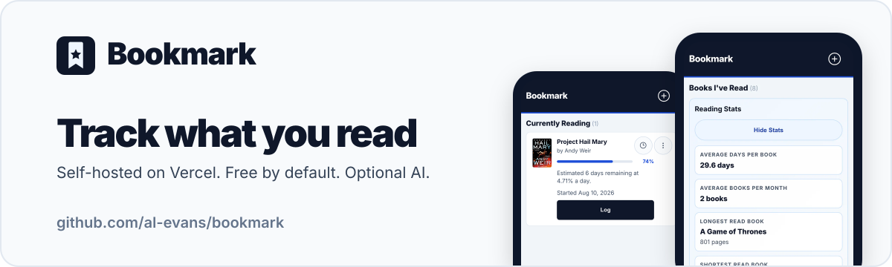
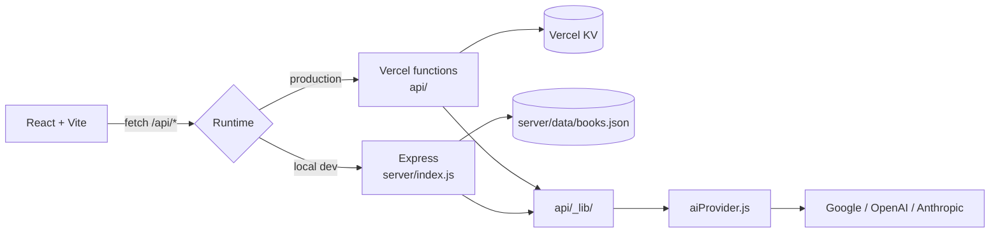

# Bookmark



A self-hosted book reading tracker built with React + Vite, deployed on Vercel.
Log what you're reading, track daily progress, get a lock-screen reminder when
you skip a day, and optionally use an AI provider of your choice for book search
and reading tips.

Everything runs in **your** Vercel project against **your** API keys. There is no
shared service and no central database — your reading data never leaves your own
deployment.

[](https://vercel.com/new/clone?repository-url=https%3A%2F%2Fgithub.com%2Fal-evans%2Fbookmark)

## Features

- **Books I've Read** – everything you've finished, grouped by month and year
- **Want to Read** – a queue of what's next
- **Add books** – manually, via Open Library search, or via AI search fallback
- **Progress tracking** – log absolute progress (`0`–`100`) and keep the history
- **Reading speed estimate** – days remaining based on your logged pace
- **Daily push reminder** – Vercel Cron notifies your phone when you haven't
  logged progress today
- **Weekly private backup** – optional GitHub Action snapshots your KV data to JSON
- **Bring your own AI** – Google Gemini, OpenAI, or Anthropic, or none at all

## Bring your own AI

AI features are **entirely optional**. Without a key the app works normally —
Open Library still powers book search, and the AI endpoints return a clean `503`
that the UI handles gracefully.

Set `AI_PROVIDER` and `AI_API_KEY` to turn them on.

| `AI_PROVIDER` | Default model | Key variable | Get a key |
|---|---|---|---|
| `google` (default) | `gemini-2.5-flash` | `AI_API_KEY` or `GEMINI_API_KEY` | [aistudio.google.com](https://aistudio.google.com/apikey) |
| `openai` | `gpt-4o-mini` | `AI_API_KEY` or `OPENAI_API_KEY` | [platform.openai.com](https://platform.openai.com/api-keys) |
| `anthropic` | `claude-3-5-haiku-latest` | `AI_API_KEY` or `ANTHROPIC_API_KEY` | [console.anthropic.com](https://console.anthropic.com/settings/keys) |

Override the model with `AI_MODEL` (for example `AI_MODEL=gpt-4o` or
`AI_MODEL=claude-sonnet-4-5`). All three providers go through the
[Vercel AI SDK](https://sdk.vercel.ai), so adding another is a small change to
`api/_lib/aiProvider.js` — see [CONTRIBUTING.md](CONTRIBUTING.md).

Your key is read **server-side only** and is never included in the browser bundle.

## Deploy your own

### 1. Fork and clone

Click **Fork** at the top of this repo, then:

```bash
git clone https://github.com/<your-username>/bookmark.git
cd bookmark
npm install
```

### 2. Create the Vercel project

Import your fork at [vercel.com/new](https://vercel.com/new). The framework
preset, build command, and output directory are already set in
[vercel.json](vercel.json), so the defaults will work.

### 3. Add a KV store

Book data is persisted in Vercel KV. In your Vercel project:

**Storage → Create Database → KV**, then connect it to the project. Vercel
injects `KV_REST_API_URL` and `KV_REST_API_TOKEN` automatically.

Without these, the deployed `/api/books` returns a configuration error.

### 4. Set environment variables

In **Project Settings → Environment Variables**:

| Variable | Required | Default | What it does |
|---|---|---|---|
| `KV_REST_API_URL` | ✅ | — | Vercel KV endpoint (auto-injected) |
| `KV_REST_API_TOKEN` | ✅ | — | Vercel KV token (auto-injected) |
| `AI_PROVIDER` | — | `google` | `google`, `openai`, or `anthropic` |
| `AI_API_KEY` | — | — | Your AI provider key; enables AI features |
| `AI_MODEL` | — | per provider | Override the model |
| `AI_TIMEOUT_MS` | — | `15000` | AI request timeout |
| `BOOKS_KV_KEY` | — | `reading-app:books` | KV key for the book list |
| `CRON_SECRET` | for reminders | — | Shared secret Vercel Cron sends |
| `ADMIN_TEST_SECRET` | for dry-runs | — | Guards the manual cron test endpoint |
| `WEB_PUSH_VAPID_PUBLIC_KEY` | for reminders | — | VAPID public key |
| `WEB_PUSH_VAPID_PRIVATE_KEY` | for reminders | — | VAPID private key |
| `WEB_PUSH_SUBJECT` | — | `mailto:notifications@example.com` | VAPID contact |
| `PUSH_SUBSCRIPTIONS_KV_KEY` | — | `reading-app:push-subscriptions` | KV key for subscriptions |
| `READING_REMINDER_META_KEY` | — | `reading-app:reminder-meta` | KV key for dedupe state |

Generate secrets with `openssl rand -hex 32`. Never commit real values —
[.gitignore](.gitignore) already excludes `.env`.

### 5. Enable push reminders (optional)

```bash
npx web-push generate-vapid-keys
```

Add the output as `WEB_PUSH_VAPID_PUBLIC_KEY` / `WEB_PUSH_VAPID_PRIVATE_KEY`,
add a `CRON_SECRET`, redeploy, then open the app on your phone and tap
**Enable Reminders**.

When no progress is logged for the current day you'll get:

> 📚 You haven't logged any reading today! Keep your 5-day streak alive.

> **Note:** the reminder window is currently hardcoded to **3:00–5:59 PM Pacific**
> (`REMINDER_START_HOUR_PT` in [api/cron-reading-reminder.js](api/cron-reading-reminder.js)).
> If you're in another timezone, adjust that constant in your fork.

### 6. Enable weekly backups (optional)

The [weekly backup workflow](.github/workflows/weekly-kv-backup.yml) snapshots
your KV book list into `backups/reading-list/` every Sunday at `08:00 UTC`.

It is **disabled by default everywhere**. To turn it on, add these repository
secrets under **Settings → Secrets and variables → Actions**:

- `KV_REST_API_URL` (or `VERCEL_KV_REST_API_URL`)
- `KV_REST_API_TOKEN` (or `VERCEL_KV_REST_API_TOKEN`)
- optional `BOOKS_KV_KEY`

Then set the repository variable `ENABLE_KV_BACKUP` to `true`.

⚠️ **This commits your reading history into your repository.** If your fork is
public, that history becomes public too, and stays in the git history even if
you delete the files later. Only enable this on a private fork.

Note that `backups/` and `books-backup.json` are listed in
[.gitignore](.gitignore) precisely so this never happens by accident — enabling
the workflow is a deliberate opt-out of that protection.

## Local development

```bash
cp .env.example .env    # fill in what you need — all of it is optional locally
npm install
npm run dev
```

Open [http://localhost:5173](http://localhost:5173).

`npm run dev` starts the Vite frontend on `:5173` and a local Express API on
`:8787` that mirrors the Vercel routes. Locally, books are stored in
`server/data/books.json` instead of KV, so you don't need a KV store to develop.

### Test from your phone on the same network

1. Find your computer's LAN IP (for example `192.168.1.42`).
2. Add it to `ALLOWED_ORIGINS` in `.env`: `http://192.168.1.42:5173`.
3. Run `npm run dev`.
4. On your phone, open `http://192.168.1.42:5173`.

Both devices talk to the same backend, so your library stays in sync.

## How it works



`api/` runs in production on Vercel and `server/index.js` mirrors those routes
for local dev. Shared logic lives in `api/_lib/` and is imported by both, so
behavior stays consistent.

### API routes

| Route | Purpose |
|---|---|
| `GET/PUT /api/books` | Read and write the book list |
| `POST /api/ai-estimate` | AI reading pace tip |
| `POST /api/ai-book-search` | AI book search fallback |
| `POST /api/enrich-book` | Open Library + AI metadata enrichment |
| `POST /api/push-subscriptions` | Store a browser push subscription |
| `GET /api/cron-reading-reminder` | Vercel Cron reminder job |
| `GET /api/admin-cron-test?job=reminder` | Manual dry-run of the reminder |
| `GET /api/health` | Health check |

### Cron schedules

[vercel.json](vercel.json) registers four UTC schedules (`0 22`, `0 23`, `0 0`,
`0 1`) because Pacific Time is UTC-8 in standard time and UTC-7 during daylight
saving. The handler enforces the real PT clock window server-side, so
out-of-window invocations skip safely and duplicate sends are deduped in KV.

### Manual dry-run

```bash
curl -H "Authorization: Bearer $ADMIN_TEST_SECRET" \
  https://your-app.vercel.app/api/admin-cron-test?job=reminder
```

Add `&mode=send` to force a real send. Default is dry-run.

**Never** pass `ADMIN_TEST_SECRET` as a URL query parameter — URLs leak through
browser history, logs, referrers, and screenshots. The app deliberately does not
read the token from query params.

## Security

Built-in protections:

- AI keys are server-side only and never reach the browser bundle
- Origin allowlist via `ALLOWED_ORIGINS`
- JSON body size limit (`10kb`) and request rate limiting
- AI request timeouts
- Prompt-injection guards on all untrusted text passed to the model
- Security headers and reduced server fingerprinting

To report a vulnerability, see [SECURITY.md](SECURITY.md).

## Scripts

| Command | Description |
|---------|-------------|
| `npm run dev` | Start frontend and backend API together |
| `npm run dev:app` | Frontend only (Vite) |
| `npm run dev:api` | Backend API only |
| `npm run build` | Production build |
| `npm run preview` | Preview the production build |
| `npm run lint` | Run ESLint |
| `npm test` | Run the test suite |
| `npm run icons:generate` | Regenerate app icons |

## Contributing

Contributions are welcome — see [CONTRIBUTING.md](CONTRIBUTING.md) and our
[Code of Conduct](CODE_OF_CONDUCT.md).

## License

[MIT](LICENSE) © Amanda Evans
